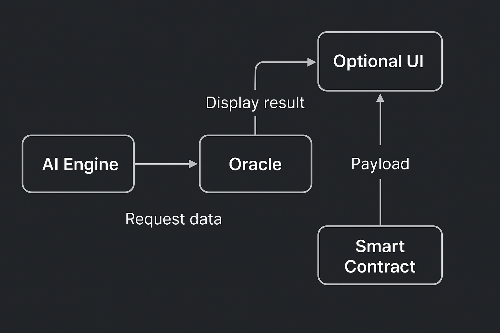

# AI Oracle Signal Prototype

This project demonstrates a modular integration between off-chain AI signals and on-chain smart contract logic using oracle infrastructure. It showcases a hybrid architecture for intelligent, cross-domain asset allocation strategies.

## 🔍 Overview

- **AI signal generation** for macro + crypto asset allocation  
- **On-chain smart contract** for receiving and routing payloads  
- **Oracle interoperability** using mock VAA and real-time price feeds  
- **Professional packaging** for GitHub presentation

## 🔍 Vision
This platform is designed to bridge the gap between traditional investors and the evolving crypto economy. Its core goal is to make AI-informed crypto allocation and yield strategies accessible to non-technical, non–crypto-native users.

While crypto ETFs and custodial products are creating more exposure pathways for traditional investors, they often stop short of unlocking the true depth of strategy available within decentralized finance. This prototype goes further by:

Automating decision-making based on AI-generated signals

Surfacing more sophisticated opportunities such as dynamic rebalancing, staking, and LP yield harvesting

Reducing friction by abstracting wallet infrastructure and on-chain interactions

Empowering users with risk-aware, programmatic access to crypto-native return streams — no DeFi fluency required

Ultimately, this system envisions a world where users can tap into algorithmic intelligence to activate high-quality crypto strategies, without needing to understand the protocols underneath. AI becomes the trusted allocator. Oracles verify signal integrity. Smart contracts encode execution.

Long-term, this design could support custodial integrations, embedded finance partnerships, and interfaces that feel as intuitive as modern fintech apps — laying the foundation for a new class of user-centric digital asset infrastructure.

### System Architecture
The diagram below illustrates the core data flow from signal generation to smart contract execution:

## 🔍 Roadmap
This roadmap reflects the evolution of a modular, AI-integrated crypto allocation platform focused on:

- Lowering barriers to crypto-native yield strategies for non-technical users  
- Bridging AI-generated insights with secure, on-chain execution  
- Designing infrastructure that abstracts complexity while retaining composability  
- Exploring integrations with custodial and embedded finance platforms  
- Enabling intuitive, scalable access to decentralized returns

📋 View full development roadmap in the [GitHub Project Board](https://github.com/users/artiecrypto/projects/1)

## 🧠 AI Signal Engine

Located in the [`ai/`](./ai) folder:

- Python script that simulates asset allocations, crypto subweights, and DeFi yield strategies
- Outputs structured JSON with rationale and confidence metrics
- Built for compatibility with cross-chain messaging systems like Wormhole or LayerZero

## ⚙️ Smart Contract Logic

Located in the [`contracts/`](./contracts) folder:

- `AIOracleIntegration.sol`: Receives encoded signal payloads and external oracle data
- Designed for gas efficiency, modularity, and simulation on Sepolia with Pyth feeds

## 🧪 Testing & Simulation

- [`test/mockVaaTest.js`](./test/mockVaaTest.js): Basic test harness for encoded signal payloads
- Includes example compressed VAA interactions and argument handling for constructor inputs

## 🧱 Architecture

The prototype reflects a user-centric financial design with an emphasis on:
- Accessibility of DeFi intelligence
- Low-code interfacing between AI and contracts
- Yield strategy transparency

## 📄 Supporting Docs

- [`dev-notes.md`](./docs/dev-notes.md): Setup, tooling, and integration rationale
- [`frontend-mock.txt`](./docs/frontend-mock
